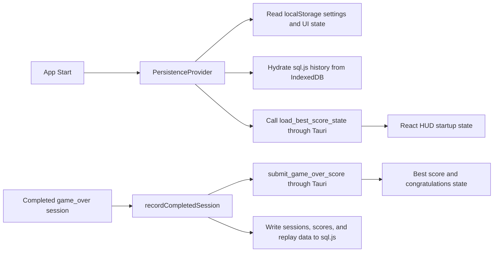

# Developer Guide: Classic Tetris Desktop

## Overview

This guide helps contributors set up, validate, and evolve the Windows-first Tauri desktop version of the project.

## Shell Prerequisite

Windows users require Git Bash (for example, Git for Windows) or WSL; PowerShell is not supported.

## Related Docs

- [User Guide](./user-guide.md)
- [Reviewer Guide](./reviewer-guide.md)
- [Persistence Reference](./persistence-reference.md)
- [Packaging Guide](./packaging/packaging.md)

## Release-Gate Status

- Last full quickstart acceptance pass: 2026-04-12
- Status: pass

## Validated Command Baseline

Validated from [specs/003-windows-desktop-packaging/quickstart.md](../specs/003-windows-desktop-packaging/quickstart.md) and the current repo command chain:

- `npm install`: install dependencies.
- `npm run dev`: frontend-only browser preview.
- `npm run tauri dev`: run the desktop runtime locally.
- `npm run lint`: ESLint baseline.
- `npm run test`: Vitest unit and integration baseline.
- `cargo test --manifest-path src-tauri/Cargo.toml`: native Rust unit and contract validation.
- `npx playwright install chromium`: browser binary remediation and first-time setup.
- `npx playwright test tests/e2e/core-gameplay.spec.ts --project=chromium --reporter=line`
- `npx playwright test tests/e2e/hud-and-strategy.spec.ts --project=chromium --reporter=line`
- `npx playwright test tests/e2e/session-persistence.spec.ts --project=chromium --reporter=line`
- `npx playwright test tests/e2e/portable-desktop-offline.spec.ts --project=chromium --reporter=line`
- `npm run build`: frontend build validation.
- `npm run tauri build`: desktop packaging validation.

## Terminology and Consistency Rules

- Canonical terms: tetromino, ghost piece, hold, hard drop, soft drop, pause/resume, best score.
- Cross-link targets: [User Guide](./user-guide.md), [Reviewer Guide](./reviewer-guide.md), [Persistence Reference](./persistence-reference.md), [Packaging Guide](./packaging/packaging.md).
- Keep command names, script names, and expected outcomes consistent with reviewer documentation.

## Contributor Setup

1. Install dependencies:

```bash
npm install
```

2. Choose a runtime:

```bash
npm run tauri dev
```

or

```bash
npm run dev
```

Use `npm run tauri dev` when changing desktop persistence, startup notices, or packaging behavior.

## npm Scripts Reference

| Script | Purpose |
| --- | --- |
| `npm run dev` | Starts the Vite development server |
| `npm run build` | Type-checks and builds frontend assets |
| `npm run lint` | Runs ESLint checks |
| `npm run test` | Runs Vitest in run mode |
| `npm run test:watch` | Runs Vitest in watch mode |
| `npm run test:e2e` | Runs the Playwright E2E suite |
| `npm run tauri dev` | Starts the Tauri desktop runtime in development |
| `npm run tauri build` | Builds the packaged desktop app |

## Repository Directory Map

| Path | Responsibility |
| --- | --- |
| `docs/` | End-user, developer, reviewer, persistence, and packaging documentation |
| `specs/` | Spec Kit feature artifacts (spec, plan, tasks, analyses) |
| `src/app/` | React app-level orchestration and runtime boundaries |
| `src/canvas/` | Gameplay rendering integration |
| `src/components/` | HUD, overlays, and other UI components |
| `src/engine/` | Deterministic game engine and rules |
| `src/persistence/` | Browser or webview persistence for settings, UI state, and structured history |
| `src-tauri/` | Native desktop runtime, storage-path policy, and best-score persistence |
| `tests/` | Contract, integration, unit, and E2E test suites |

## Architecture Overview

Core concerns are separated into five areas:

1. Game engine: deterministic state transitions and gameplay rules.
2. Rendering: canvas-based visual output driven by engine state.
3. Application state: React-level orchestration of UI and runtime boundaries.
4. Browser or webview persistence: `localStorage` for settings and UI state, plus `sql.js` persisted through IndexedDB for sessions, scores, and replay history.
5. Native desktop persistence: Rust plus SQLite for startup best-score hydration, strict new-record evaluation, storage fallback, and corruption recovery.

This separation keeps gameplay testable while making desktop responsibilities explicit.

## Startup and Game-Over Data Flow



Key rules:

1. The game engine never calls Tauri commands directly.
2. The best-score panel stays hidden until the native layer reports that at least one completed game exists.
3. Only `game_over` submissions are allowed to update the stored best score.
4. A congratulations message appears only for a strictly greater final score.

## Testing Strategy

- Lint: `npm run lint`
- Frontend unit and integration validation: `npm run test`
- Native Rust validation: `cargo test --manifest-path src-tauri/Cargo.toml`
- Browser regression E2E: the three scoped Playwright commands from the repo instructions
- Desktop-local smoke: `npx playwright test tests/e2e/portable-desktop-offline.spec.ts --project=chromium --reporter=line`
- Packaging validation: `npm run tauri build`

The preferred local sequence is lint, frontend tests, Rust tests, browser E2E, then Tauri build and desktop smoke.

## Build Workflow

Frontend-only build:

```bash
npm run build
```

Desktop packaging build:

```bash
npm run tauri build
```

`npm run tauri build` runs the frontend build first and then produces the Windows bundle output.

## Verified Validation Outcomes

Latest validated outcomes on the current desktop branch:

- `npm run lint`: completed without reported lint failures.
- `npm run test`: `15` test files passed and `44` tests passed.
- `cargo test --manifest-path src-tauri/Cargo.toml`: `7` native unit tests passed, `2` load-state contract tests passed, `2` startup-recovery contract tests passed, and `3` submit-game-over contract tests passed.
- `npx playwright test tests/e2e/core-gameplay.spec.ts --project=chromium --reporter=line`: `1 passed`.
- `npx playwright test tests/e2e/hud-and-strategy.spec.ts --project=chromium --reporter=line`: `1 passed`.
- `npx playwright test tests/e2e/session-persistence.spec.ts --project=chromium --reporter=line`: `2 passed`.
- `npx playwright test tests/e2e/portable-desktop-offline.spec.ts --project=chromium --reporter=line`: `1 passed`.
- `npm run tauri build`: completed successfully and produced release output under `src-tauri/target/release/` and bundled output under `src-tauri/target/release/bundle/`.

## Code Quality Expectations

- Keep documentation and command examples aligned with runtime behavior.
- Do not introduce PowerShell command variants.
- Ensure terminology remains canonical across user, developer, reviewer, persistence, and packaging docs.
- Treat failing validation commands as blockers until corrected.
- Keep generated Tauri directories excluded from lint and review noise.

## Contributor Walkthrough Validation

Use this check to validate the guide:

1. Follow only this guide to install dependencies and run `npm run tauri dev`.
2. Run `npm run lint`, `npm run test`, `cargo test --manifest-path src-tauri/Cargo.toml`, and the scoped Playwright commands.
3. Locate the primary runtime areas (`src/engine/`, `src/app/`, `src/persistence/`, `src-tauri/`) using the directory map.
4. Confirm the startup and game-over data flow in this guide is sufficient to trace where to change best-score behavior.

If this walkthrough fails, revise this guide before release sign-off.
