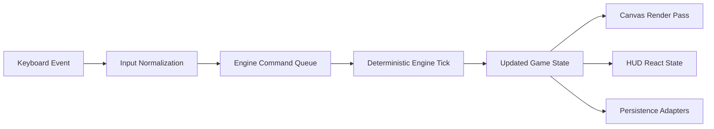

# Developer Guide: Classic Browser Tetris

## Overview

This guide helps contributors set up, validate, and evolve the project.

## Shell Prerequisite

Windows users require Git Bash (for example, Git for Windows) or WSL; PowerShell is not supported.

## Related Docs

- [User Guide](./user-guide.md)
- [Reviewer Guide](./reviewer-guide.md)
- [Persistence Reference](./persistence-reference.md)

## Validated Command Baseline

Validated from [specs/002-project-docs/quickstart.md](../specs/002-project-docs/quickstart.md):

- `npm install`: install dependencies.
- `npm run dev`: run local app.
- `npm run lint` and `npm run test`: quality baseline.
- `npx playwright install chromium`: browser binary remediation and first-time setup.
- `npx playwright test tests/e2e/core-gameplay.spec.ts --project=chromium --reporter=line`
- `npx playwright test tests/e2e/hud-and-strategy.spec.ts --project=chromium --reporter=line`
- `npx playwright test tests/e2e/session-persistence.spec.ts --project=chromium --reporter=line`
- `npm run build`: production build validation.

## Terminology and Consistency Rules

- Canonical terms: tetromino, ghost piece, hold, hard drop, soft drop, pause/resume, best score.
- Cross-link targets: [User Guide](./user-guide.md), [Reviewer Guide](./reviewer-guide.md), [Persistence Reference](./persistence-reference.md).
- Keep command names, script names, and expected outcomes consistent with reviewer documentation.

## Contributor Setup

1. Install dependencies:

```bash
npm install
```

2. Start the local development server:

```bash
npm run dev
```

3. Open the Vite local URL shown in the terminal.

## npm Scripts Reference

| Script | Purpose |
| --- | --- |
| `npm run dev` | Starts Vite development server |
| `npm run build` | Type-checks and builds production assets |
| `npm run lint` | Runs ESLint checks |
| `npm run test` | Runs Vitest in run mode |
| `npm run test:watch` | Runs Vitest in watch mode |
| `npm run test:e2e` | Runs Playwright E2E suite |

## Repository Directory Map

| Path | Responsibility |
| --- | --- |
| `docs/` | End-user, developer, reviewer, and persistence documentation |
| `specs/` | Spec Kit feature artifacts (spec, plan, tasks, analyses) |
| `src/app/` | React app-level orchestration and state boundaries |
| `src/canvas/` | Gameplay rendering integration |
| `src/components/` | UI components and panels |
| `src/engine/` | Deterministic game engine and rules |
| `src/persistence/` | localStorage and SQLite/IndexedDB adapters |
| `tests/` | Contract, integration, unit, and E2E test suites |

## Architecture Overview

Core concerns are separated into four areas:

1. Game engine: deterministic state transitions and gameplay rules.
2. Rendering: canvas-based visual output driven by engine state.
3. Application state: React-level orchestration of UI and runtime boundaries.
4. Persistence: browser-local storage for settings and structured history.

This separation keeps rule behavior testable and documentation traceable to runtime sources.

## Input-to-Render Data Flow



Step-by-step:

1. Browser keyboard events are normalized into known gameplay commands.
2. Commands are queued and consumed by deterministic engine ticks.
3. The engine emits updated game state for playfield, metrics, and overlays.
4. Canvas rendering consumes gameplay state to draw board, active piece, and ghost piece.
5. React HUD state and persistence adapters consume the same state update for UI and storage synchronization.

## Testing Strategy

- Unit and integration validation: `npm run test`
- End-to-end validation: `npm run test:e2e` or the three scoped Playwright commands
- Lint validation: `npm run lint`

The preferred local sequence is lint, tests, then E2E.

## Build Workflow

```bash
npm run build
```

This runs TypeScript checks and produces the production bundle.

## Code Quality Expectations

- Keep documentation and command examples aligned with runtime behavior.
- Do not introduce PowerShell command variants.
- Ensure terminology remains canonical across user, developer, reviewer, and persistence docs.
- Treat failing validation commands as blockers until corrected.

## Contributor Walkthrough Validation

Use this check to validate SC-002:

1. Follow only this guide to install dependencies and run the app.
2. Run `npm run lint`, `npm run test`, and the scoped Playwright commands.
3. Locate the primary runtime areas (`src/engine/`, `src/canvas/`, `src/persistence/`, `src/app/`) using the directory map.
4. Confirm the input-to-render flow in this guide is sufficient to trace where to make a small change.

If this walkthrough fails, revise this guide before release sign-off.
