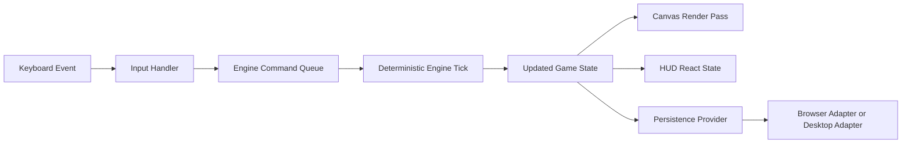

# Developer Guide: Classic Browser Tetris

## Overview

This guide describes how to work on the shared renderer, the Electron shell, and the runtime-specific persistence boundaries.

## Supported Shell

Windows contributors must use Git Bash. Do not mix Bash and PowerShell commands in the same workflow.

## Related Docs

- [User Guide](./user-guide.md)
- [Reviewer Guide](./reviewer-guide.md)
- [Windows Development Workflow](./windows-development.md)
- [Desktop Architecture](./desktop-architecture.md)
- [Persistence Reference](./persistence-reference.md)

## Runtime Model

The repository has two supported runtime paths:

- browser mode through `npm run dev:web`
- desktop mode through `npm run dev`

Shared renderer code lives under `src/` and must remain Electron-agnostic. Desktop-only behavior is exposed through preload and runtime boundary modules rather than direct `electron` imports in shared UI code.

## Install And First Run

```bash
npm install
npx playwright install chromium
```

Use browser mode first for shared-renderer work:

```bash
npm run dev:web
```

Use desktop mode when validating preload, packaging, or desktop persistence:

```bash
npm run dev
```

## npm Scripts Reference

| Script | Purpose |
| --- | --- |
| `npm run dev:web` | Starts the Vite browser workflow on `127.0.0.1:4173` |
| `npm run dev` | Starts browser server, Electron build watch, and Electron shell together |
| `npm run dev:electron:build` | Watches Electron TypeScript output |
| `npm run dev:electron:start` | Waits for browser and Electron build outputs, then launches Electron |
| `npm run build` | Builds renderer and Electron outputs |
| `npm run build:renderer` | Type-checks and builds the Vite renderer |
| `npm run build:electron` | Compiles Electron main and preload |
| `npm run dist:win` | Builds the portable Windows artifact |
| `npm run lint` | Runs ESLint |
| `npm run test` | Runs Vitest |
| `npm run test:e2e` | Runs the Playwright suite |

## Repository Directory Map

| Path | Responsibility |
| --- | --- |
| `electron/` | Electron main and preload entry points |
| `docs/` | User, developer, reviewer, persistence, packaging, and workflow docs |
| `scripts/` | Local workflow helpers such as the Electron dev launcher |
| `specs/` | Spec Kit feature artifacts |
| `src/app/` | React orchestration, runtime labels, and persistence provider wiring |
| `src/canvas/` | Canvas rendering integration |
| `src/components/` | HUD, overlays, and input-facing UI components |
| `src/engine/` | Deterministic gameplay engine and rules |
| `src/persistence/` | Shared SQLite bootstrap plus browser and desktop persistence adapters |
| `src/platform/` | Runtime selection and boundary helpers |
| `tests/` | Unit, integration, contract, and E2E validation |

## Architecture Summary

Core concerns are separated into these layers:

1. Engine: deterministic gameplay state transitions.
2. Renderer: canvas and HUD output driven by engine state.
3. Runtime boundary: browser and desktop detection plus typed desktop bridge access.
4. Persistence: shared `sql.js` schema with browser and desktop storage adapters.
5. Shell: Electron main and preload for desktop launch, file-backed persistence, and runtime metadata.

## Input, Runtime, And Persistence Flow



## Validation Baseline

Use this order when touching shared logic:

```bash
npm run lint
npm run test
npm run build
npx playwright test tests/e2e/core-gameplay.spec.ts --project=chromium --reporter=line
npx playwright test tests/e2e/session-persistence.spec.ts --project=chromium --reporter=line
npx playwright test tests/e2e/desktop-shell.spec.ts --project=chromium --reporter=line
```

Use `npm run dist:win` when changing desktop packaging or validating the portable Windows artifact.

## Contributor Guardrails

- Validate `npm run dev:web` before treating a regression as Electron-specific.
- Keep desktop-only renderer access behind `window.desktopApi`.
- Do not import `electron`, `node:fs`, or similar Node-only APIs into shared renderer modules.
- Treat browser and desktop persistence as separate storage domains in the first release.
- Keep docs synchronized with command names and runtime behavior.

## Developer Walkthrough

1. Install dependencies and browser binaries.
2. Run `npm run dev:web` and confirm the browser shell shows `Runtime browser/web`.
3. Run `npm run dev` and confirm the Electron shell shows `Runtime desktop/win32 v0.1.0` on the current validated machine.
4. Run `npm run build` and `npm run dist:win`.
5. Run the scoped Playwright validation slices for browser continuity and desktop shell coverage.
